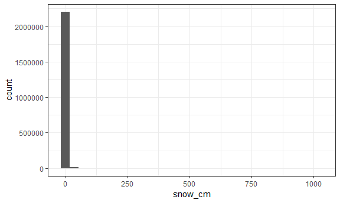

p8105\_hw3\_js5431
================
J Shearston
October 6, 2018

-   [Problem \#1](#problem-1)
    -   [Data Import and Cleaning](#data-import-and-cleaning)
    -   [Questions and Responses](#questions-and-responses)
-   [Problem \#2](#problem-2)
    -   [Data Import and Cleaning](#data-import-and-cleaning-1)
    -   [Instacart Dataset Description](#instacart-dataset-description)
    -   [Questions and Responses](#questions-and-responses-1)
-   [Problem \#3](#problem-3)
    -   [Data Import and Cleaning](#data-import-and-cleaning-2)
    -   [NOAA Dataset Description](#noaa-dataset-description)
    -   [Questions and Responses](#questions-and-responses-2)

Problem \#1
-----------

#### Data Import and Cleaning

``` r
library(p8105.datasets)

brfss = p8105.datasets::brfss_smart2010 %>% 
  janitor::clean_names() %>%
  rename(state = locationabbr, 
         county = locationdesc) %>% 
  filter(topic == "Overall Health") %>%
  arrange(year, state, county) %>% 
  mutate(response = ordered(response, levels = c("Excellent", "Very good", "Good", "Fair", "Poor"))) %>%
  select(year, state, county, response, data_value)
```

#### Questions and Responses

-   In 2002, which states were observed at 7 locations?
    -   In 2002, 3 states were observed at 7 locations: Connecticut, Florida, and North Carolina.

``` r
 brfss %>% 
  filter(year == "2002") %>% 
  group_by(state) %>% 
  summarize(n_counties = n_distinct(county)) %>% 
  filter(n_counties == 7)
```

    ## # A tibble: 3 x 2
    ##   state n_counties
    ##   <chr>      <int>
    ## 1 CT             7
    ## 2 FL             7
    ## 3 NC             7

-   Make a “spaghetti plot” that shows the number of locations in each state from 2002 to 2010.
    -   This plot is horrifying. I removed the legend, as trying to determine which line represents which individual state is anxiety inducing. Overall, I would say that this plot shows that for most states, the total number of locations has remained fairly constant over time, with a few states having very large variability.

``` r
brfss %>%
  group_by(year, state) %>% 
  summarize(n_counties = n_distinct(county)) %>% 
  ggplot(aes(x = year, y = n_counties, color = state)) +
  geom_line() +
  labs(
    title = "Total Observations",
    x = "Year",
    y = "No. of Observed Counties",
    caption = "Data from the BRFSS, p8105 datasets package") +
  theme(legend.position="none")
```


-   Make a table showing, for the years 2002, 2006, and 2010, the mean and standard deviation of the proportion of “Excellent” responses across locations in NY State.
    -   The mean and standard deviation of the proportion of "Excellent" responses is pretty similar for NY state for all three years.

``` r
brfss %>% 
  filter(state == "NY", 
         response == "Excellent", 
         year == 2002 | year == 2006 | year ==2010) %>% 
  group_by(year) %>% 
  summarize(excel_mean = mean(data_value),
            excel_sd = sd(data_value)) %>% 
  knitr::kable(digits = 2)
```

|  year|  excel\_mean|  excel\_sd|
|-----:|------------:|----------:|
|  2002|        24.04|       4.49|
|  2006|        22.53|       4.00|
|  2010|        22.70|       3.57|

-   For each year and state, compute the average proportion in each response category (taking the average across locations in a state). Make a five-panel plot that shows, for each response category separately, the distribution of these state-level averages over time.
    -   Over time, the proportion of overall responses in each category seems to stay fairly consistent, such that "Very good" is consistently the most selected response, and "Poor" is the least selected. Within each category, there is some variability by state in the actual proportion of respondents who select each choice; interestingly, this variability sees similar for each choice, with the exception of "Poor", which seems to have a smaller variability.

``` r
brfss %>%
  group_by(year, state, response) %>% 
  summarise(avgby_response = mean(data_value, na.rm = (TRUE), round(2))) %>%
  ggplot(aes(x = year, y = avgby_response, color = state)) +
  geom_point() +
  facet_grid(~response) +
  theme(legend.position = "none")
```


Problem \#2
-----------

#### Data Import and Cleaning

``` r
library(p8105.datasets)

icart = p8105.datasets::instacart %>% 
  janitor::clean_names()
```

#### Instacart Dataset Description

The Instacart dataset includes data from selected orders from an online grocery store; it contains 1384617 rows and 15 columns, and is formatted such that each row is a product from an order. Only one order for any particular individual is inlcuded.

Key variables include several unique IDs, such as order ID, product ID, and user ID; product information such as product name, aisle, and department; and interesting order information such as the time of day the order was placed and if the item has been ordered before. For example, an individual (user id = 112108) purchased 8 items as part of their order, including yogurt, milk, celery, cucumber, sardines, bananas, avacado, and string cheese. These items were ordered at 10 am, and 4 of them had been ordered by this customer in the past.

#### Questions and Responses

-   How many aisles are there, and which aisles are the most items ordered from?
    -   There are 134 aisles, and the following aisles are most ordered from: Fresh vegetables, fresh fruits, packaged vegetables fruits, yogurt, and packaged cheese.

``` r
icart %>%
  summarize(dist_aisle = n_distinct(aisle_id, na.rm = TRUE))
```

    ## # A tibble: 1 x 1
    ##   dist_aisle
    ##        <int>
    ## 1        134

``` r
icart %>% 
  group_by(aisle) %>% 
  summarize(n()) %>% 
  top_n(5)
```

    ## Selecting by n()

    ## # A tibble: 5 x 2
    ##   aisle                       `n()`
    ##   <chr>                       <int>
    ## 1 fresh fruits               150473
    ## 2 fresh vegetables           150609
    ## 3 packaged cheese             41699
    ## 4 packaged vegetables fruits  78493
    ## 5 yogurt                      55240

-   Make a plot that shows the number of items ordered in each aisle. Order aisles sensibly, and organize your plot so others can read it.
    -   The produce department, which only appears to have 5 aisles, has by far the largest number of items ordered from it. Interestingly, the personal care department has a large number of aisles, but a much smaller amount of products are ordered from them.

``` r
icart %>% 
  group_by(department, aisle_id) %>% 
  summarize(items_aisle = n()) %>% 
  ggplot(aes(x = aisle_id, y = department)) +
  geom_point(aes(size = items_aisle), alpha = .5) +
  labs(
    title = "Number of Items Ordered, by Aisle",
    x = "Aisle ID",
    y = "Department",
    caption = "Data from Instacart, p8105 package"
  ) +
  scale_size(name = "Number of Items Ordered")
```


-   Make a table showing the most popular item in the aisles “baking ingredients”, “dog food care”, and “packaged vegetables fruits”
    -   The most popular item in the packaged vegetables fruits aisle, organic baby spinach, was ordered 9,784 times, while the ost popular item in the dog food care aisle, a type of dog treat, was only ordered 30 times.

``` r
icart %>% 
  filter(aisle == "baking ingredients" | 
           aisle == "dog food care" |
           aisle == "packaged vegetables fruits") %>% 
  group_by(aisle, product_name) %>% 
  summarise(prod_n = n()) %>% 
  top_n(1) %>% 
  knitr::kable()
```

    ## Selecting by prod_n

| aisle                      | product\_name                                 |  prod\_n|
|:---------------------------|:----------------------------------------------|--------:|
| baking ingredients         | Light Brown Sugar                             |      499|
| dog food care              | Snack Sticks Chicken & Rice Recipe Dog Treats |       30|
| packaged vegetables fruits | Organic Baby Spinach                          |     9784|

-   Make a table showing the mean hour of the day at which Pink Lady Apples and Coffee Ice Cream are ordered on each day of the week; format this table for human readers (i.e. produce a 2 x 7 table).
    -   On day 0 (Sunday) and day 5 (Friday), both Pink Lady Apples and Coffee Ice Cream are ordered at about the same time of day. However, on all other days of the week, Coffee Ice Cream is ordered later in the day than Pink Lady Apples. In other words, as the day goes on, perhaps icart shoppers' coffee ice cream cravings increase.

``` r
icart %>%
  filter(product_name == "Pink Lady Apples" |
           product_name == "Coffee Ice Cream") %>% 
  group_by(order_dow, product_name) %>% 
  summarise(mean_hour = mean(order_hour_of_day)) %>% 
  spread(key = order_dow, value = mean_hour) %>% 
  knitr::kable()
```

| product\_name    |         0|         1|         2|         3|         4|         5|         6|
|:-----------------|---------:|---------:|---------:|---------:|---------:|---------:|---------:|
| Coffee Ice Cream |  13.77419|  14.31579|  15.38095|  15.31818|  15.21739|  12.26316|  13.83333|
| Pink Lady Apples |  13.44118|  11.36000|  11.70213|  14.25000|  11.55172|  12.78431|  11.93750|

Problem \#3
-----------

#### Data Import and Cleaning

``` r
noaa = p8105.datasets::ny_noaa %>% 
  janitor::clean_names()

skimr::skim(noaa)
```

    ## Skim summary statistics
    ##  n obs: 2595176 
    ##  n variables: 7 
    ## 
    ## -- Variable type:character ---------------------------------------------------------------------
    ##  variable missing complete       n min max empty n_unique
    ##        id       0  2595176 2595176  11  11     0      747
    ##      tmax 1134358  1460818 2595176   1   4     0      532
    ##      tmin 1134420  1460756 2595176   1   4     0      548
    ## 
    ## -- Variable type:Date --------------------------------------------------------------------------
    ##  variable missing complete       n        min        max     median
    ##      date       0  2595176 2595176 1981-01-01 2010-12-31 1997-01-21
    ##  n_unique
    ##     10957
    ## 
    ## -- Variable type:integer -----------------------------------------------------------------------
    ##  variable missing complete       n  mean     sd  p0 p25 p50 p75  p100
    ##      prcp  145838  2449338 2595176 29.82  78.18   0   0   0  23 22860
    ##      snow  381221  2213955 2595176  4.99  27.22 -13   0   0   0 10160
    ##      snwd  591786  2003390 2595176 37.31 113.54   0   0   0   0  9195
    ##      hist
    ##  <U+2587><U+2581><U+2581><U+2581><U+2581><U+2581><U+2581><U+2581>
    ##  <U+2587><U+2581><U+2581><U+2581><U+2581><U+2581><U+2581><U+2581>
    ##  <U+2587><U+2581><U+2581><U+2581><U+2581><U+2581><U+2581><U+2581>

#### NOAA Dataset Description

The NOAA dataset contains select weather information for New York state, spanning the years 1981 to 2010, and contains 2595176 rows and 7 columns. Data is entered as location-date observations, with the following variables: location id, date, precipitation (tenths of mm), snow (mm), snow depth (mm), and max and min temperature (tenths of degrees C). There is a lot of missing data, and the dataset documentation mentions that not all locations collected information on snowfall amounts.

#### Questions and Responses

-   Do some data cleaning. Create separate variables for year, month, and day. Ensure observations for temperature, precipitation, and snowfall are given in reasonable units. For snowfall, what are the most commonly observed values? Why?
    -   For snowfall, 0 cm is the most commonly observed value. This makes sense for a couple of reasons: in the state of New York, it does not smow most of the time, and when it does snow, it does not snow at all locations. Also, the data is currently recorded to one decimal point, and it is unlikely that many snowfalls are similar to the tenth of a cm. However, even after rounding to whole centimeters, 0 is still the most common response.

``` r
noaa = p8105.datasets::ny_noaa %>% 
  janitor::clean_names() %>% 
  separate(date, into = c("year", "month", "day"), sep = "-") %>% 
  mutate(tmax = as.numeric(tmax),
         tmin = as.numeric(tmin),
         tmax_c = tmax/10,
         tmin_c = tmin/10,
         prcp_mm = prcp/10,
         snow_cm = snow/10,
         snwd_cm = snwd/10) %>% 
  select(id, year, month, day, tmax_c, tmin_c, prcp_mm, snow_cm, snwd_cm)

noaa %>% 
  ggplot(aes(x = snow_cm)) +
  geom_histogram()
```

    ## `stat_bin()` using `bins = 30`. Pick better value with `binwidth`.

    ## Warning: Removed 381221 rows containing non-finite values (stat_bin).



``` r
noaa %>% 
  mutate(snow_cmr = round(snow_cm)) %>% 
  ggplot(aes(x = snow_cmr)) +
  geom_histogram()
```

    ## `stat_bin()` using `bins = 30`. Pick better value with `binwidth`.

    ## Warning: Removed 381221 rows containing non-finite values (stat_bin).


-   Make a two-panel plot showing the average temperature in January and in July in each station across years. Is there any observable / interpretable structure? Any outliers?
    -   Answer
-   Make a two-panel plot showing (i) tmax vs tmin for the full dataset (note that a scatterplot may not be the best option); and (ii) make a plot showing the distribution of snowfall values greater than 0 and less than 100 separately by year.
    -   Answer
