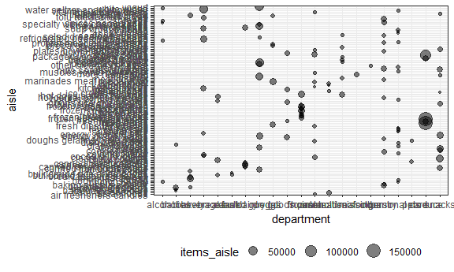

p8105\_hw3\_js5431
================
J Shearston
October 6, 2018

-   [Problem \#1](#problem-1)
    -   [Data Import and Cleaning](#data-import-and-cleaning)
    -   [Questions and Responses](#questions-and-responses)
-   [Problem \#2](#problem-2)

Problem \#1
-----------

#### Data Import and Cleaning

``` r
library(p8105.datasets)

brfss = p8105.datasets::brfss_smart2010 %>% 
  janitor::clean_names() %>%
  rename(state = locationabbr, 
         county = locationdesc) %>% 
  filter(topic == "Overall Health") %>%
  arrange(year, state, county) %>% 
  mutate(response = ordered(response, levels = c("Excellent", "Very good", "Good", "Fair", "Poor"))) %>%
  select(year, state, county, response, data_value)
```

#### Questions and Responses

-   In 2002, which states were observed at 7 locations?
    -   In 2002, 3 states were observed at 7 locations: Connecticut, Florida, and North Carolina.

``` r
 brfss %>% 
  filter(year == "2002") %>% 
  group_by(state) %>% 
  summarize(n_counties = n_distinct(county)) %>% 
  filter(n_counties == 7)
```

    ## # A tibble: 3 x 2
    ##   state n_counties
    ##   <chr>      <int>
    ## 1 CT             7
    ## 2 FL             7
    ## 3 NC             7

-   Make a “spaghetti plot” that shows the number of locations in each state from 2002 to 2010.
    -   This plot is horrifying. I removed the legend, as trying to determine which line represents which individual state is anxiety inducing. Overall, I would say that this plot shows that for most states, the total number of locations has remained fairly constant over time, with a few states having very large variability.

``` r
brfss %>%
  group_by(year, state) %>% 
  summarize(n_counties = n_distinct(county)) %>% 
  ggplot(aes(x = year, y = n_counties, color = state)) +
  geom_line() +
  labs(
    title = "Total Observations",
    x = "Year",
    y = "No. of Observed Counties",
    caption = "Data from the BRFSS, p8105 datasets package") +
  theme(legend.position="none")
```


-   Make a table showing, for the years 2002, 2006, and 2010, the mean and standard deviation of the proportion of “Excellent” responses across locations in NY State.
    -   The mean and standard deviation of the proportion of "Excellent" responses is pretty similar for NY state for all three years.

``` r
brfss %>% 
  filter(state == "NY", 
         response == "Excellent", 
         year == 2002 | year == 2006 | year ==2010) %>% 
  group_by(year) %>% 
  summarize(excel_mean = mean(data_value),
            excel_sd = sd(data_value)) %>% 
  knitr::kable(digits = 2)
```

|  year|  excel\_mean|  excel\_sd|
|-----:|------------:|----------:|
|  2002|        24.04|       4.49|
|  2006|        22.53|       4.00|
|  2010|        22.70|       3.57|

-   For each year and state, compute the average proportion in each response category (taking the average across locations in a state). Make a five-panel plot that shows, for each response category separately, the distribution of these state-level averages over time.
    -   Over time, the proportion of overall responses in each category seems to stay fairly consistent, such that "Very good" is consistently the most selected response, and "Poor" is the least selected. Within each category, there is some variability by state in the actual proportion of respondents who select each choice; interestingly, this variability sees similar for each choice, with the exception of "Poor", which seems to have a smaller variability.

``` r
brfss %>%
  group_by(year, state, response) %>% 
  summarise(avgby_response = mean(data_value, na.rm = (TRUE), round(2))) %>%
  ggplot(aes(x = year, y = avgby_response, color = state)) +
  geom_point() +
  facet_grid(~response) +
  theme(legend.position = "none")
```



Problem \#2
-----------
